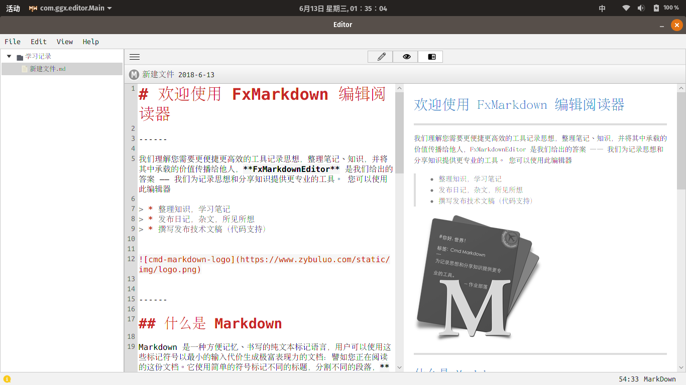

# FxMarkdownEditor #

使用JavaFx编写的开源Markdown编辑器，代码用于学习和分享使用。

### Feature ###

* 编辑器语法高亮
* 查找和替换
* HTML时事预览
* 文件树结构目录层次
* 编辑，预览，编辑/预览切换
* 支持Windows,Linux

### Thanks very much ###

* [RichTextFX](https://github.com/FXMisc/RichTextFX)
* [ReactFX](https://github.com/TomasMikula/ReactFX)
* [flexmark-java](https://github.com/vsch/flexmark-java)
* [JFoenix](https://github.com/jfoenixadmin/JFoenix)
* [Markdown Writer FX](https://github.com/JFormDesigner/markdown-writer-fx)

#### 特别感谢 ####
十分感谢[Markdown Writer FX](https://github.com/JFormDesigner/markdown-writer-fx)项目，给了我不少参考和建议。
尤其是对于我这种JavaFx刚接触的门外汉来说。

### Contact ###

我的QQ群：392154157
