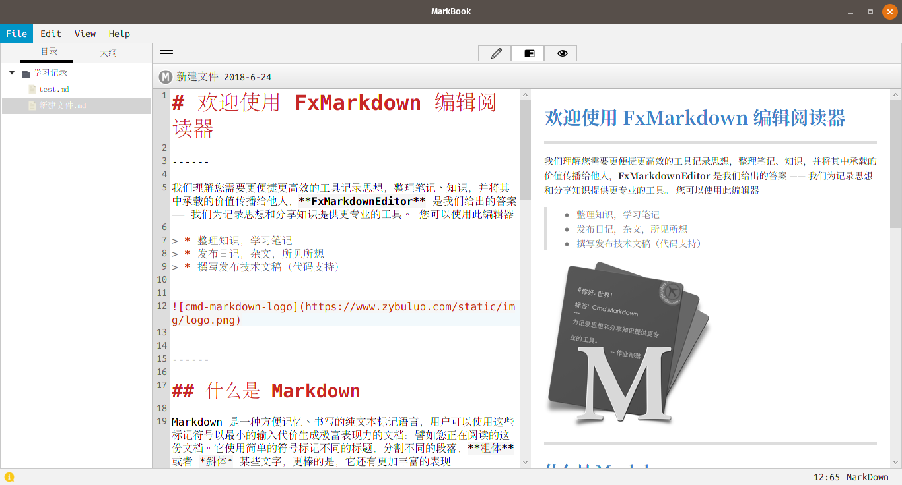

# FxMarkdownEditor #

**时隔多年，一直忙碌在温饱的奔波，该项目也就搁置了，最近有想法重新捡起来，继续完善此项目，等空下来将会有一场大的变革**

使用JavaFx编写的开源Markdown编辑器，代码用于学习和分享使用。

### Features ###

* 编辑器语法高亮
* 查找和替换
* HTML即时预览
* 文件树结构目录层次
* 编辑，预览，编辑/预览切换
* 文章标题大纲
* MarkdownToHTML
* 支持Windows,Linux,MacOs

### TODO ###

* 数学公式支持
* 时序图，流程图支持
* 自定义CSS属性
* 更多的设置选项

### Requirements ###
需要Java 8u40 或者更高的版本，当前不支持Java9.
Gradle版本4.0或者更高。

### Thanks very much ###

* [RichTextFX](https://github.com/FXMisc/RichTextFX)
* [ReactFX](https://github.com/TomasMikula/ReactFX)
* [flexmark-java](https://github.com/vsch/flexmark-java)
* [JFoenix](https://github.com/jfoenixadmin/JFoenix)
* [Markdown Writer FX](https://github.com/JFormDesigner/markdown-writer-fx)

#### 特别感谢 ####
十分感谢[Markdown Writer FX](https://github.com/JFormDesigner/markdown-writer-fx)项目，给了我不少参考和建议。
尤其是对于我这种JavaFx刚接触的门外汉来说。

### Contact ###

如有遇到问题可以在issues中提问。 
我的QQ群：392154157 
推荐国内的JavaFx交流群：518914410。欢迎您的加入

